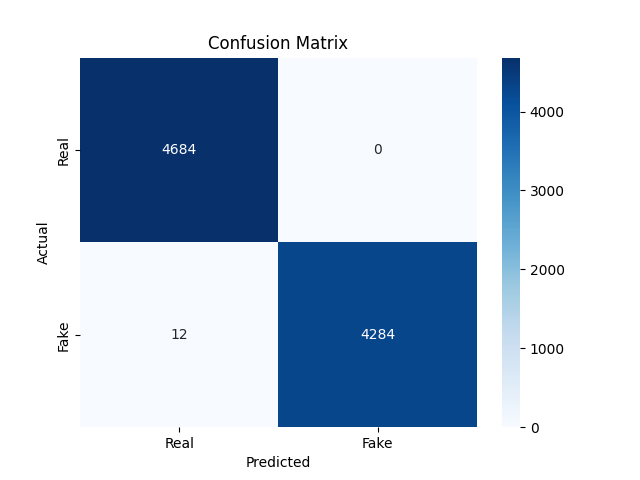

# 📰 Fake News Detector (ML + Transformers)

This project aims to classify news articles as **Fake** or **Real** using both traditional Machine Learning (Logistic Regression, Random Forest) and a Transformer-based model (DistilBERT). The app also includes a user-friendly interface built with **Gradio** and a live feed from **NewsAPI**.

---

## 🔍 Features

- ✅ Logistic Regression & Random Forest baseline models using TF-IDF
- ✅ Transformer model (DistilBERT) via Hugging Face
- ✅ Evaluation with classification report & confusion matrix
- ✅ Gradio app for live predictions
- ✅ Integration with NewsAPI to fetch and test real headlines
- ✅ Confidence scores for predictions

---

## 🗂️ File Structure

```

📦fake-news-detector/
┣📁 notebooks/                           
┃ ┣ 📄 misinformation-model.ipynb    ← Main Jupyter Notebook for DistilBERT
┃ ┗ 📄 fake-news-detector.ipynb      ← Main Jupyter Notebook for logistic regression and random tree
┣ 📁 src/                           
┃ ┣ 📄 predict.py                    ← prediction script for transformer
┃ ┣ 📄 train_model.py                ← training script for transformer
┃ ┗ 📄 evaluate.py                   ← Evaluation script for transformer
┣ 📄 app.py                          ← Gradio UI for model inference
┣ 📁 data/                           ← Contains Fake.csv and True.csv
┃ ┣ 📄 Fake.csv
┃ ┗ 📄 True.csv
┣ 📁 misinformation_model_final/     ← Trained DistilBERT model
┣ llm_layer.py                       ← Optional LLM verification layer (if using OpenAI)
┗ 📄 README.md

````
## 🧠 Models Used

| Model              | Preprocessing Tool | Accuracy (Approx.)        |
|--------------------|--------------------|---------------------------|
| Logistic Regression| TF-IDF             | ✅ Good baseline          |
| Random Forest      | TF-IDF             | ✅ Robust alternative     |
| DistilBERT         | Tokenizer + HF API | ✅ Best performance       |
---

## 🧠 Model Training Summary

- **TF-IDF + Logistic Regression / Random Forest**:
    - Trained on a merged dataset of `Fake.csv` and `True.csv`
    - Labels: `0` → Fake, `1` → Real

- **Transformer (DistilBERT)**:
    - Fine-tuned on Hugging Face Transformers
    - Tokenized using `AutoTokenizer`
    - Evaluated using accuracy, precision, recall, F1-score

---

## 🚀 Run the Project

### 1. Clone the repo

```bash
git clone https://github.com/yourusername/fake-news-detector.git
cd fake-news-detector
````
### 2. Make a virtual environment

```bash
python -m venv venv
source venv/Scripts/activate
````

### 3. Install dependencies

```bash
pip install -r requirements.txt
```

If using GPU:

```bash
pip install torch torchvision torchaudio --index-url https://download.pytorch.org/whl/cu121 
#not required to run if u have downlaoded the model from drive
```
### 4. Train the models

# For the LR and RF models just re-run the jupyter notebook with a models directory in the project directory.

# For the DistilBERT model I would recommend to download it through the drive else you have to rewrite the train_model.py code in google colab as window CPU would take around 5-6 hours to train while colab can do it in 45 minutes.Download it and save it according to the project directory.

### 5. Run Gradio app

```bash
python app.py
```
Or test it on Hugging Face:
👉 [🧪 Try Demo](https://huggingface.co/spaces/harshbpathak/misinformation-filter)

---

## 🌐 Live Testing with NewsAPI

The project uses `newsapi` to fetch top headlines and classify them using both models.

Set your API key:

```python
newsapi = NewsApiClient(api_key="YOUR_NEWS_API_KEY")
```

---

## 📊 Example Results

Confusion Matrix (DistilBERT):



---

## 💡 Future Improvements

* Add step-by-step instructions for installing Python and setting up your environment for absolute beginners.
* Integrate and document the optional LLM verification layer (`llm_layer.py`) for enhanced prediction reliability.
* Expand dataset with multilingual news

---
## 📚 Dataset

* [Fake and Real News Dataset on Kaggle](https://www.kaggle.com/datasets/clmentbisaillon/fake-and-real-news-dataset)

---

## 🙌 Acknowledgements

* [Fake and Real News Dataset - Kaggle](https://www.kaggle.com/clmentbisaillon/fake-and-real-news-dataset)
* [Hugging Face Transformers](https://huggingface.co/transformers/)
* [NewsAPI](https://newsapi.org)

```

